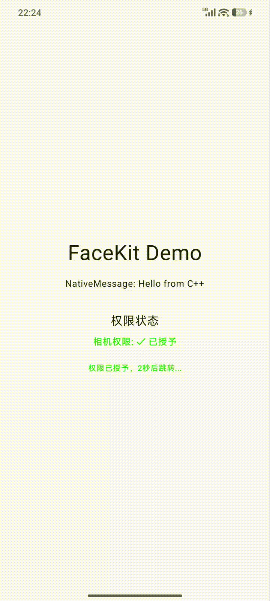

# mFaceKit

基于 MNN + PFLD 实现的人脸关键点检测与简易瘦脸效果示例工程。
本意是想实现一个移动端（安卓+iOS）的媒体数据处理框架（采集+渲染+编解码），并实现一些基础的美颜美妆效果，暂时实现度还较低，后续会不断完善。

## 模块说明

1. `android/egl`：封装 EGL 操作框架与可创建 shared context 的 EGLSurfaceView
2. `android/JNIEnvManager`：自动管理 JNIEnv 的工具类
3. `core` + `io`：实现 source + pipeline + destination 的数据处理链路
4. `render`：渲染与上屏相关逻辑，以及 facemesh 的渲染实现
